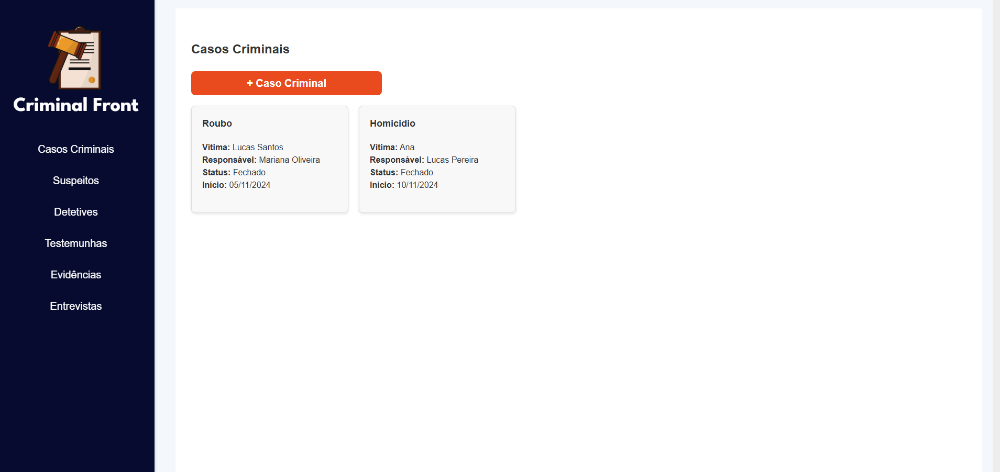
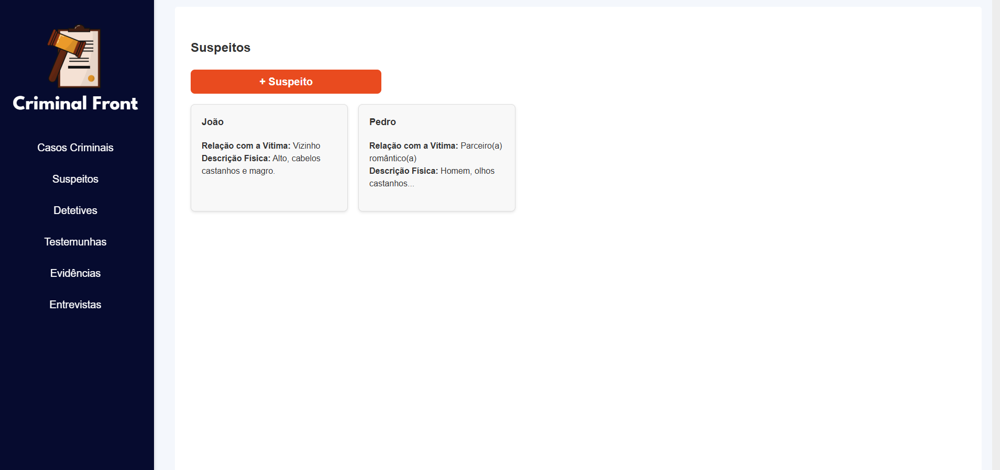
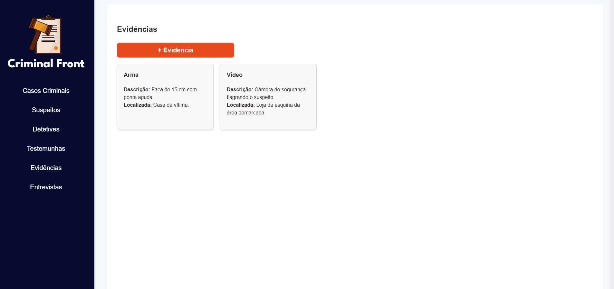

# ⚖️ Criminal Frontend

Frontend React + TypeScript + Vite para o sistema de gerenciamento de processos criminais.

---

## 📂 Estrutura do Projeto

```
/
├── public/          # Arquivos estáticos
├── src/             # Código-fonte React + TypeScript
├── screenshots/     # Prints das telas para documentação e demonstração
├── index.html       # Arquivo HTML principal
├── vite.config.ts   # Configuração do Vite
├── package.json     # Dependências e scripts
└── README.md        # Documentação do projeto
```

---

## 🚀 Tecnologias Utilizadas

- React 
- TypeScript
- Vite (bundler rápido com HMR)
- ESLint com regras específicas para React e TypeScript
- [@vitejs/plugin-react](https://github.com/vitejs/vite-plugin-react) ou [@vitejs/plugin-react-swc](https://github.com/vitejs/vite-plugin-react-swc)

---

## 🎯 Como Rodar

Clone o repositório e instale as dependências:

```bash
git clone https://github.com/nathaliacosim/criminal-front-public.git
cd criminal-front-public
npm install
```

Inicie a aplicação em modo desenvolvimento com hot reload:

```bash
npm run dev
```

Para buildar para produção:

```bash
npm run build
```

Para testar a build localmente:

```bash
npm run preview
```

---

## 🧹 ESLint

Configuração avançada para garantir código limpo e com tipagem correta em React + TypeScript.

---

## 📸 Screenshots

Veja algumas telas do sistema na pasta [`screenshots/`](./screenshots):

- `casos-criminais.png` — Casos Criminais  
  

- `suspeitos.png` — Suspeitos  
  

- `evidencias.png` — Evidências  
  


---

## 🤝 Contribuições

Contribuições são sempre bem-vindas! Abra issues ou pull requests para colaborar.

---

## 📄 Licença

MIT License — consulte o arquivo LICENSE para detalhes.

---

## 👩‍💻 Desenvolvido por

**Nathalia Cosim**  

[](https://github.com/nathaliacosim)  
[](https://linkedin.com/in/nathaliacosim)
